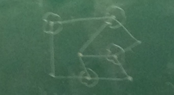

## Co-NP

A problem is in Co-NP if its complement is in NP.

i.e. verifiable proofs of no instances (counter-example) exist.

__e.g.__
Given a finite set of integers, does every non-empty subset have a nonzero sum?

* A counter-example is easy to verify: add up a set of integers.

__Reduction__

1. SAT &rarr; __3-SAT__
  * An algorithm that applies to 3-SAT, can also be applied to SAT.
  * __(a1 v a2 v ... v ak)__ is satisfied iff the corresponding 3-CNF formula is satisifed.

2. The __3-CNF__ formula
  * In order for it to be satisfied, at least one of the ai has to be true.
  * Assume that there is an assignment of the yk that satisfies the 3-CNF formula but the values of the ai are such that the top formulas is not satisfied.
    * First choice: we have to set y1 to T
    * Second choice: '' '' '' y2 to T
    * '' '' ''
    * Last choice: all literals are false and the 3-CNF formula is not satisfied &larr; contradiction

3. 3-SAT &rarr; __Independent Set__
  * We must somehow show how we can answer problem involving boolean formulas using graphs.
  * Representation transformation: create a triangle
    * (x- v y v z-) ^ (x v y- z) ^ (x v y v z) ^ (x- v y-)
    * Introduce an edge between opposite literals
    * e.g. x and x-

4. Independent Set &rarr; __Vertex Cover__ (Know for Final)
  * A set of nodes S is a vertex cover of a graph G(V,C) if and only if the remaining vertices correspond to an independent set.
  * 
  * Highlighted vertices: vertex cover
  * Remaining vertices: independent set

5. Independent Set &rarr; __Clique__
  * Define the complement of a graph G(V,E) to be G-(V,E-), where E- contains all the edges that do not exist in G
  * S: independent set in G iff
  * S: clique in G-

5. Any problem in NP &rarr; __(Circuit)-SAT__
  * Circuit-SAT: given a boolean circuit of DAG made up from gates:
    * &rarr; AND/OR
    * &rarr; NOT
    * &rarr; input gates: true or false
    * &rarr; unknown input gates
  * 
  * Given values for the unknown input gates, we can evaluate the gates of the circuit in topological order to compute the output
  * Circuit-SAT: is there an assignment to the unknown input gates that will give a True for output?
  * Circuit-SAT can be reduced to SAT
    * We can rewrite any circuit/boolean formula to CNF
    * For each gate g, we can create the equivalent boolean formula using clauses
  * Or-gate: (g v h2-) ^ (g v h1-) ^ (g- v h1- v h2-)
