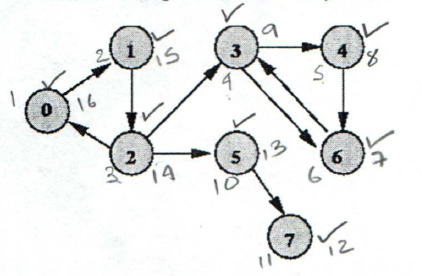
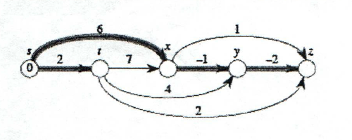

#### An adjacency matrix representation can quickly detect if an edge exists but the representation requires _O(|V|<sup>3</sup>)_ space (i.e. _O|V|<sup>2</sup>_) for each vertex). An adjacency list has smaller space requirements [_O(V * log|V|)_ in general] but detecting edge existence is not constant time.

> __False.__  
> * An adjacency matrix can quickly detect if an edge exists but the space requirement is __O(|V|<sup>2</sup>)__.
> * An adjacency list has smaller space requirements __O(|V| + |E|)__ but we need to find the edge and that operation is not constant time anymore.

#### Consider a general graph G(V,E). The best known algorithm for finding a path from a specific vertex _s_ to a specific vertex _t_ in _G_ has better asymptotic running time (i.e. is faster) than the best known algorithm for finding the paths from all the vertices in _V_ to a vertex _t_ in _G_.

> __False.__  
> Finding all possible paths from all vertices from _V_ to all other vertices has the same complexity as finding the shortest path from a specific vertex _s_ to a specific vertex _t_.

#### A shortest path cannot possibly contain a zero-weight cycle.

> __False.__  
> The shortest path algorithm can have zero-weight cycle. They are simply ignored by the algorithm, so that the shortest paths they find have no cycles.

#### Dijkstra's running time depends on the implementation of the priority queue data structure. An array implementation results in a running time of _O(|V|<sup>2</sup>)_ and is preferred in dense graphs. A binary heap implementation results in _O(|V|log|V| + |E|)_ and is preferred in sparse graphs.

> __False.__  
> A binary heap results in _O((|V| * |E|) log|V|).

> __Side-note.__  
> * You use __simple array__ if its dense and __binary heap__ if its sparse.
> * A simple array results in _O(|V|<sup>2</sup>)_.

#### On a sparse graph with non-negative edges it is preferable to run |V| times Dijkstra's algorithm using a binary heap in order to compute the shortest paths between all pairs of nodes than running Floyd-Warshall's algorithm, which has a running time of _&Theta;(|V|<sup>3</sup>)_.

> __True.__  
> * Sparse graph with binary heap will give a better complexity than Floyd-Warshall's algorithm.
> * Dijkstra's with Binary heap = __O(|V|<sup>2</sup>log|V|)__
> * Floyd-Warshall's = __O(|V|<sup>3</sup>)__

#### You are transferring (or robbing...) money from a bank and you have already filled _n_ duffel bags with case. Each duffel bag _i_ is unique, contains a known amount of money _m<sub>j</sub>_ and has a known volume _v<sub>i</sub>_. You are trying to fit the bags in the trunk of your car which has volume _V_, so as to maximize the amount of money that you can transfer in one trip. Provide a dynamic programming solution to this problem (i.e. identify the subproblems and show how are they combined to solve larger problems).

> __Subproblems.__  
> For the problem we can take volume _V_ (volume of the trunk) using a matrix our subproblems.  
> * When _v = 0_, what's the max amount of money I can take and with which bags (V=1, v=2, ..., v).
> * Since each bag is unique, we can't repeat any bags, so we need an additional variable to keep track the volume of the bags, the variable will also be part of our optimal solution.

> __Solution.__  
> ```c
> if (v<sub>i</sub> &gt; V)
>	K(i,v) = K(v, i-1)
> else
>	K(i,v) = max[K(v,i-1), k(v-v<sub>i</sub>, i-1 + v<sub>i</sub>)]
> return K(v,i)
> ```

> __Side-note.__  
> * This is the Knapsack problem without repetition.

#### What is the running time of the dynamic programming solution for the above problem and why?

> __O(nV)__

> Since we defined our subproblems according to  
> * V = the volume of the trunk
> * n = the amount of the bags we have

#### A subsequence is palindromic if it is the same whether read left to right or right to left. For instance, the sequence: A,C,G,T,G,T,C,A,A,A,A,T,C,G has many palindromic subsequences, including A,C,G,C,A and A,A,A,A (on the other hand, the subsquence A,C,T is not palindromic). Devise an algorithm that takes a sequence x[1,...,n] and returns the length of the longest palindromic subsequence. Its running time should be _O(n<sub>2</sub>)_.

> Apply the __longest common subsequence algorithm__.  
> * We have sequence S and T (S reversed).

> ```
> for i=0 to n
>	LPS[i,0] = 0
> for j=0 to n
>	LPS[0,j] = 0
>
> for i=1 to n
> 	for j=1 to n
>		if [Si == Ti]
>			LPS[i,j] = LPS[i-1,j-1]
>		else
>			LPS[i,j] = max[LPS(i-1,j), LPS(i,j-1)]
> return LPS[n,n]
> ```

#### Provide the depth-first search tree for the given graph below, starting from node 0. Break ties by visiting first nodes that have a smaller index. Indicate the pre-visit and post-visit order for each node on the given table.



> Nodes | 0 | 1 | 2 | 3 | 4 | 5 | 6 | 7
> --- | --- | --- | --- | --- | --- | --- | --- | ---
> Pre-vist | 1 | 2 | 3 | 4 | 5 | 10 | 6 | 11
> Post-visit | 16 | 15 | 14 | 9 | 8 | 13 | 7 | 12

#### What is the definition of a strongly connected component?

> A dircted graph is called strongly connected if there is a path in each direction between each pair of verticies of the graph.

#### Provide the efficient algorithm for computing the decomposition of a directed graph into its strongly connected components.

> Given graph G:

> 1. We need to do this in order to run DFS and organize the nodes in a post-order increasing order.
> 2. We have a property that says that the nodes with the highest post order is the source and the lowest post order are sinks, in other words they reverse G to get the sinks of the graph.
> 3. Run the connected component alog of undirected graphs to find the connected components.
> 4. Since they are now organized according to the post order , I now have the sets of Strongly Connected Components thanks to algo in part two.

#### What is the running time of the efficient algorithm and why?

> __O(n)__

#### Consider the graph shown below. Describe an efficient approach for computing single-source shortest paths on this graph. What is the running time of the efficient solution?



> ```c
> procedure dag-shortest-paths(G,l,s)
>  for all u element of K:
>      dist(u) = infinity
>      prev(u) = nil
>
>  dist(s) = 0
>  Linearize G
>  for each u element K, in linearized order:
>      for all edges (u,k) element of E:
>          update(u,k)
> ```

> The overall running time is __O(k + E)__.

#### Consider a directed graph with (possibly negative) weighted edges, in which the shortest path between any two vertices is guaranteed to have at most _k_ edges. Write an algorithm in pseudocode that finds that shortest path between two vertices _u_ and _v_ in O(k|E|) time.

> ```c
> procedure shortest-paths(G,l,s)
>  for all u element of k:
>      dist(u) = infinity
>      prev(u) = nil
>
>  dist(s) = 0
>  repeat |k| - 1 times:
>      for all e element of E:
>          update(e)
> ```

> The overall running time is __O(k|E|)__.

#### Consider a graph _G(V,E)_ with weights _w_. Furthermore, define a value function _h:V -> R_ for every vertex of the graph. Then define a new set of weights as follows: _&#373;(u,v) = w(u,v) + h(u) - h(v)_ for every edge(u,v) &#8712; E. Prove the following facts:

* A path _p = &lt; v<sub>0</sub>,v<sub>1</sub>,...,v<sub>k</sub> &gt;_ is a shortest path on G according to weights &#373; only if it is also a shortest path according to weights _w_.

> Pikachu!

* Moreover, negative cycles exist on the graph _G_ according to weights &#373; only if they exist for the weights _w_ as well.

> Pikachu!

* Algorithm

> * The algorithm constructs the augmented graph G&#39;.
> * Uses Bellman-Ford from _s_ to check whether there are negative weight cycles.
> * Performs weight adjustment with _h_.
> * Runs Dikjstra's algorithm from each start vertex, reversing the weight adjustment to obtain the final distances